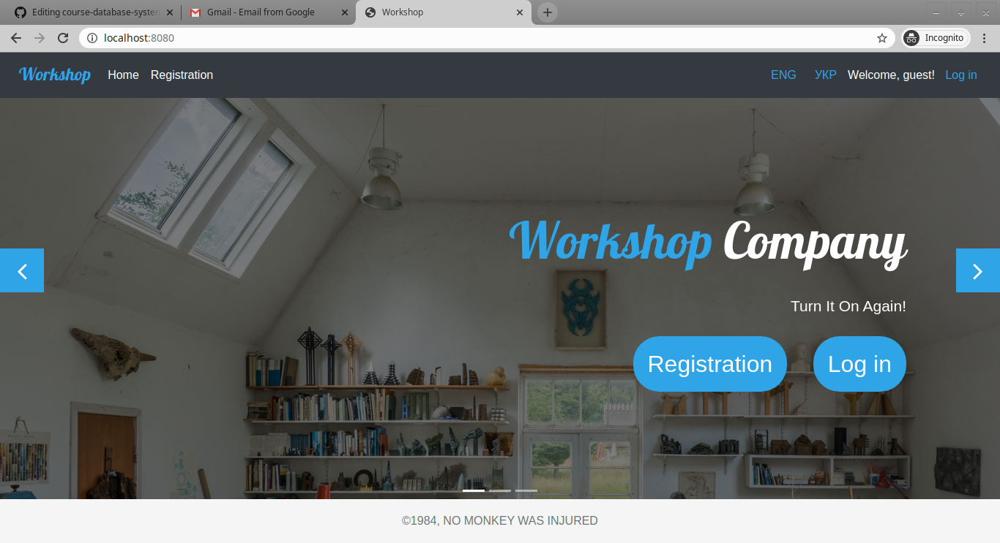

[![Awesome][icon-awesome]][awesome]
&nbsp;&nbsp;&nbsp;&nbsp;&nbsp;&nbsp;
<div align="center">
	
</div>

# workshop
## Final Project - Spring Boot version
https://spring-boot-workshop.herokuapp.com/  
admin:  
login: albus_dumbledore  
password: password  

user:  
login: barbie  
password: password  

manager:  
login: jack_sparrow  
password: password  

## Система **Ремонтне Агентство**  
1. **Користувач** може створювати заявки на ремонт виробу  
1. **Менеджер** може прийняти заявку, вказавши ціну, або відхилити, вказавши причину  
1. **Майстер** може виконати прийняту Менеджером заявку  
1. **Користувач** може залишити відгук про виконані роботи  

### How to install  

1. Clone project  
1. You can use default settings and work with database on zanner.org.ua MySql server or [install and configure MySQL](my-sql.md)  
1. Run in terminal command: ```mvn clean spring-boot:run```  
1. Go to link: [```localhost:8080```](http://localhost:8080/)  

[icon-awesome]: https://cdn.rawgit.com/sindresorhus/awesome/d7305f38d29fed78fa85652e3a63e154dd8e8829/media/badge.svg
[awesome]: https://github.com/sindresorhus/awesome
